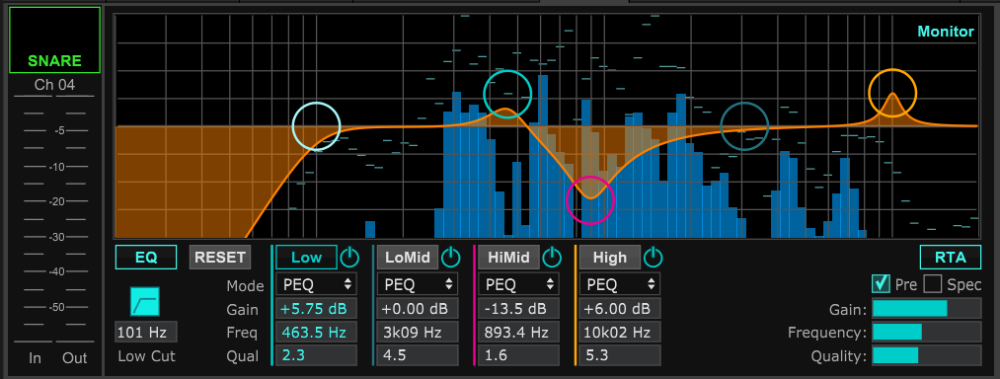
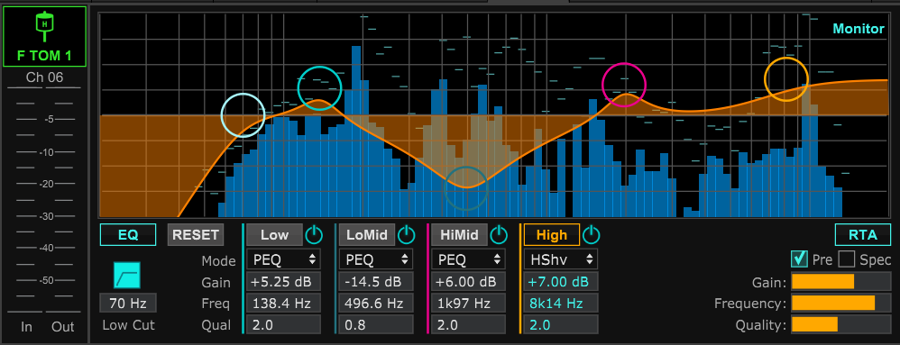
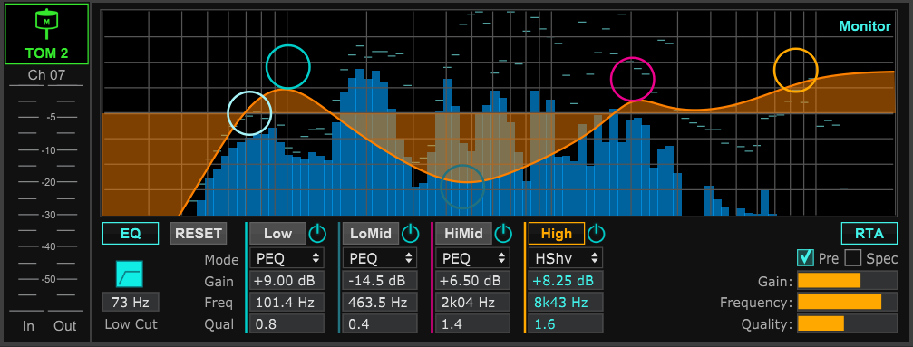
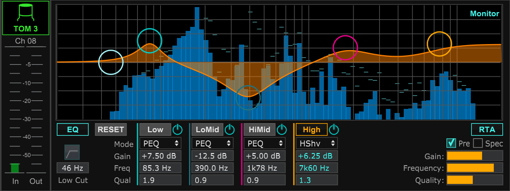

# **Baiboly - Une application pour enrichir votre quotidien spirituel**

Pour les CHRÉTIENS, voici un projet de **Baiboly** pensé pour accompagner votre lecture quotidienne des Écritures. Cette application a été conçue pour être facile à utiliser, agréable pour les yeux, et adaptée à vos besoins.

## **Fonctionnalités principales :**
- **Thèmes personnalisables :** Choisissez entre un thème clair et un thème sombre pour une lecture adaptée à tout moment de la journée.
- **Polices optimisées :** Une sélection de polices spécialement choisies pour offrir un confort visuel optimal.
- **Surligneur personnalisable :** Mettez en évidence vos versets préférés avec une couleur de votre choix.
- **Copie facile des versets :** Copiez un ou plusieurs versets en un seul geste, parfait pour partager ou conserver vos passages préférés.
- **Concordance :** Une puissante fonctionnalité de recherche pour retrouver rapidement un mot-clé ou un livre spécifique dans la Bible.
- **Interface dynamique et responsive :** Une interface fluide qui s'adapte parfaitement à tous les écrans, que ce soit sur ordinateur ou appareil mobile.
- **Navigation simplifiée :** Faites défiler les chapitres facilement à l'aide des touches fléchées (haut et bas) pour un confort de lecture inégalé.
- **Mode lecture assistée :** Une fonctionnalité qui ajuste l'affichage pour une meilleure lisibilité sur les écrans de toutes tailles.

## **Formats disponibles :**
- **Application Web :** Accessible directement depuis votre navigateur préféré, sans besoin d'installation.
- **Logiciel de bureau :** Une version téléchargeable pour Windows, macOS et Linux, adaptée pour une utilisation hors ligne.

## **Avantages supplémentaires :**
- **Mode hors ligne :** Lisez la Bible même sans connexion Internet grâce à une base de données locale (disponible sur la version de bureau).

## **Support et communauté :**
Rejoignez une communauté de croyants pour partager vos expériences, poser des questions, et profiter de conseils spirituels. Si vous rencontrez un problème ou avez des suggestions, n'hésitez pas à nous contacter.

Voici le contenu de l’image sous forme de tableau structuré :

| **TRACK**   | **EQ BOOST**                                                                 | **EQ CUT**                                                         | **COMPRESS**                                           |
|------------|------------------------------------------------------------------------------|--------------------------------------------------------------------|--------------------------------------------------------|
| **KICK**    | 50-70Hz for low-end   2.5-4.5kHz for slap   8kHz for click & attack    | 150-350Hz for mud   700-900Hz for boxiness or "basketball" sound | Slow Attack   Fast Release                          |
| **SNARE**   | 8kHz for crack/snap   2.5kHz for midrange attack   200Hz for low end   | 500-700Hz for boxiness                                             | Slow Attack   Fast Release                          |
| **TOMS**    | 120-200Hz for low end (rack tom)   70-90Hz for low end (floor tom)   4.5kHz for attack   8kHz for attack | 150-300Hz for mud   700-900Hz for boxy or "basketball" sound   | Slow Attack   Fast Release                          |
| **OVERHEADS** | 12kHz shelf for high-end sheen                                              | HPF 200Hz or higher   400-700Hz for boxiness and reduce kit sound | Medium-fast Attack   Fast Release                  |
| **ROOMS**   | 80Hz for low end   5-8kHz for presence                                   | 150-350Hz for mud   8kHz and above for harshness                | Fast Attack   Fast Release   Compress hard to bring out ambience |
| **BASS**    | 50-80Hz for sub/low-end   1kHz for attitude & cut in the mix   2-2.5kHz for "grind" and presence | 350-700Hz for boxiness   LPF at 4kHz                            | Medium Attack   Medium-fast Release                 |

